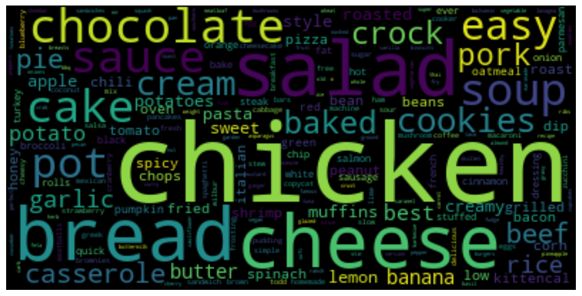

# food-sentiment
## Sentiment analysis on the Food.com dataset

The Food.com dataset contains 700K+ reviews of 180K+ food recipes over 18 years of users uploads.
The dataset can be found on Kaggle at the following url: https://www.kaggle.com/datasets/shuyangli94/food-com-recipes-and-user-interactions.

In this project we analyse the reviews using two very different NLP models: [TextBlob](https://textblob.readthedocs.io/en/dev/) and a pretrained model based on the popular BERT transformer, called [DistilBERT](https://huggingface.co/distilbert-base-uncased-finetuned-sst-2-english).

This project is divided into three notebooks:

- <code>wordclouds.ipynb</code>, where Word Clouds like the one in the picture below are computed based on word frequencies.
- <code>preprocess_dataset.ipynb</code>, where we perform a statistical exploration of the raw dataset and preprocess it in order to prepare it for the following analysis.
- <code>sentiment_analysis.ipynb</code>, where a sentiment analysis is performed on the preprocessed dataset using the above two NLP models. Moreover, a classifier is trained to distinguish between positive and negative reviews based on the most frequent words contained in the reviews.

